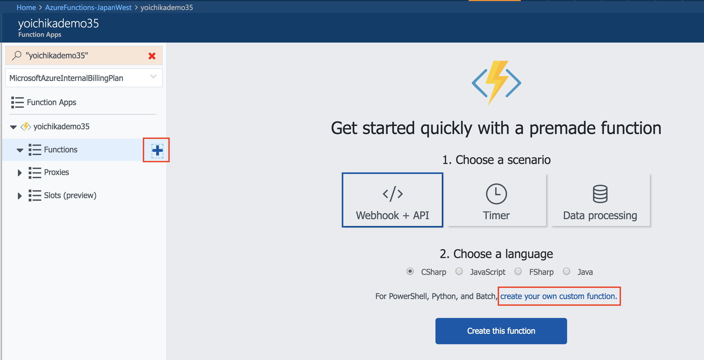
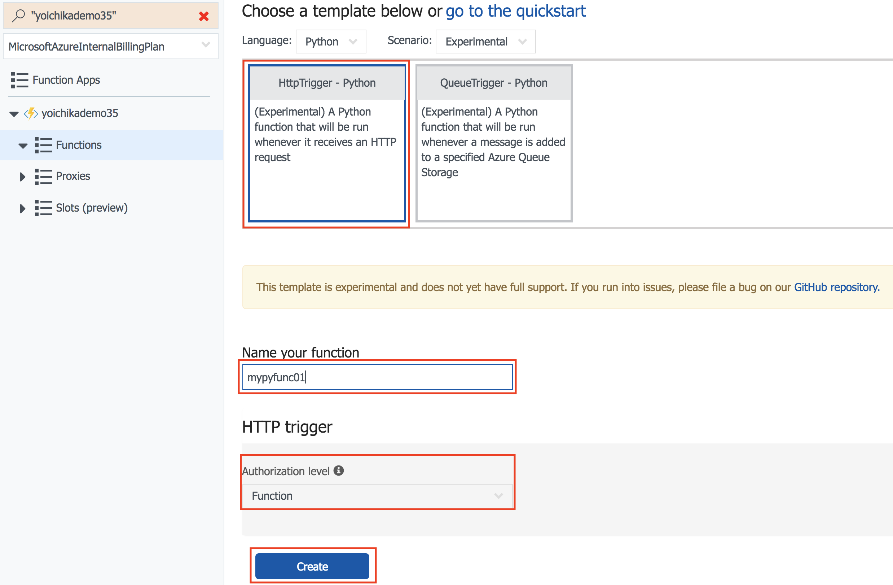
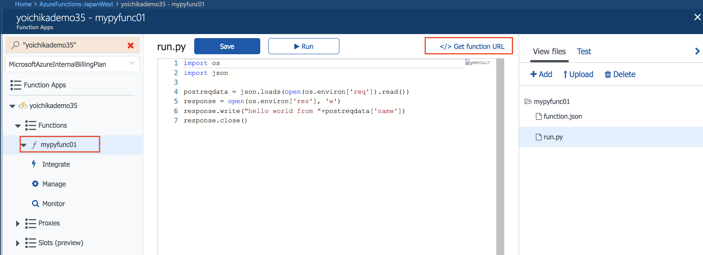
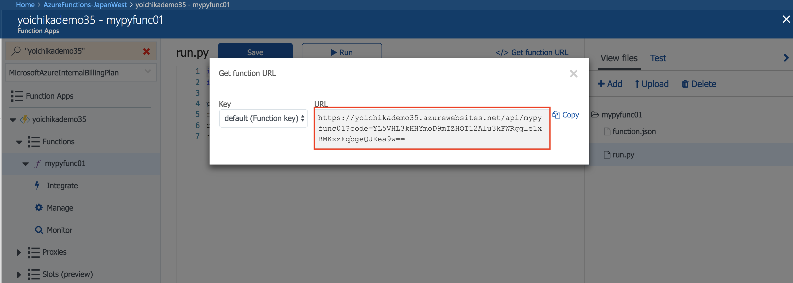

# Create a first Python Function in the Azure portal

## Create a Function App (if you don't have yet)

Create a Function App in the Azure portal by following an article - [Create your first function in the Azure portal - Create a function app](https://docs.microsoft.com/en-us/azure/azure-functions/functions-create-first-azure-function#create-a-function-app)

## Create an HTTP triggered function (Python)

### 1. Expand your new function app, then click the + button next to Functions.

### 2. In the Get started quickly page, click **Create your own custom function**



Then, select **Python** in pull down menu for Language.


Select "HttpTrigger - Python" template, typein **myfunc01** for Name your function text box, choose **Function** for Authentication Level, and press Create button.


### 3. Test the function
In your new function, click **</> Get function URL** 


Light box will come up, then select default (Function key), and then click Copy.


You will get the following function URL: 
```
https://<your_function_app _anme>.azurewebsites.net/api/mypyfunc01?code=YXVHL3kHHYmoD9mIZHOT12Alu3kFWRggle1xBMKxzFqbgeQJKea9w==
```

Here is a simple curl command to send HTTP POST request to the function URL with sample body data:

```
curl -s -XPOST "https://yoichikademo35.azurewebsites.net/api/mypyfunc01?code=YXVHL3kHHYmoD9mIZHOT12Alu3kFWRggle1xBMKxzFqbgeQJKea9w==" -d'{ "name": "Azure Functions" }'

(result)
"hello world from Azure Functions"
```

For your testing, just replace the command above with your function URL.

## LINKS
* [Create your first function in the Azure portal](https://docs.microsoft.com/en-us/azure/azure-functions/functions-create-first-azure-function)
