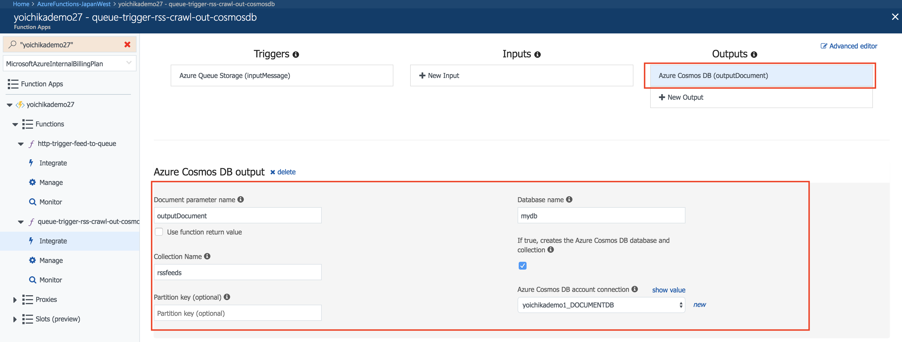
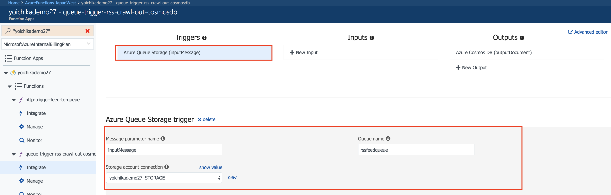
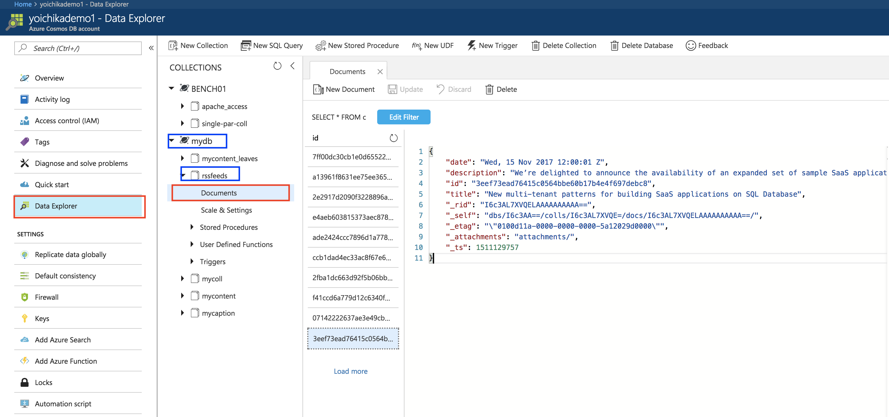

# モジュール2 - Queueトリガーで取得したフィードURLを元にクローリングを行いその内容をCosmosDB (Document DB)に保存　

Queueトリガーで取得したフィードURLを元にクローリングを行いその内容をCosmosDB (Document DB)に保存します.

モジュール１とモジュール２はセットになります。

## 1. Function Appの作成 (まだ作成していない場合のみ)

* [Create a first Python Function in the Azure portal](https://github.com/yokawasa/azure-functions-python-samples/blob/master/docs/create-function-app-in-azure-portal.md)をベースにAzureポータルで作成

## 2. ソースコードをGithubよりダウンロード(まだの場合のみ)
レポジトリ: https://github.com/yokawasa/azure-functions-python-samples

```
git clone https://github.com/yokawasa/azure-functions-python-samples.git
```
もしくはレポジトリからZIPで[ダウンロード](https://github.com/yokawasa/azure-functions-python-samples/archive/master.zip)

モジュール1のマテリアル配置場所: azure-functions-python-samples/handson/module1配下

## 3. CosmosDBアカウントの作成

* [CosmosDBアカウントの作成方法](https://docs.microsoft.com/ja-jp/azure/cosmos-db/tutorial-develop-documentdb-dotnet#create-an-azure-cosmos-db-account)

## 4. Functionのデプロイ

Azureポータルまたはコマンドでデプロイ

* Azureポータルの場合
手順については[こちら](../../docs/create-function-app-in-azure-portal.md)を参照ください

* コマンドの場合 (ここではgit)
手順については[こちら](../../docs/local-git-deployment_ja.md)を参照ください

## 5. Pythonライブラリの追加 (feedparser)

Kudu UI >> CMDプロンプトで次の手順によりpipを使ってライブラリをインストールする. 特権権限が必要であるためKudu UIからの実行が必要
Virtualenvを利用して今回のFunction用ディレクトリ(プロジェクト)ごとにインストールしていることが特徴

```
D:\home>
D:\home> cd site\wwwroot\queue-trigger-rss-crawl-out-cosmosdb
D:\home\site\wwwroot\queue-trigger-rss-crawl-out-cosmosdb> python -m pip list
    pip (1.5.6)
    setuptools (6.0.2)
    virtualenv (1.11.6)

D:\home\site\wwwroot\queue-trigger-rss-crawl-out-cosmosdb> python -m virtualenv myenv
D:\home\site\wwwroot\queue-trigger-rss-crawl-out-cosmosdb> cd myenv\Scripts
D:\home\site\wwwroot\queue-trigger-rss-crawl-out-cosmosdb\myenv\Scripts> activate.bat
(myenv) D:\home\site\wwwroot\queue-trigger-rss-crawl-out-cosmosdb\myenv\Scripts>
(myenv) D:\home\site\wwwroot\queue-trigger-rss-crawl-out-cosmosdb\myenv\Scripts>python -m pip install -U pip
    Downloading/unpacking pip from https://pypi.python.org/packages/b6/ac/7015eb97dc749283ffdec1c3a88ddb8ae03b8fad0f0e611408f196358da3/pip-9.0.1-py2.py3-none-any.whl#md5=297dbd16ef53bcef0447d245815f5144
    Installing collected packages: pip
        Found existing installation: pip 1.5.6
            Uninstalling pip:
            Successfully uninstalled pip
    Successfully installed pip
    Cleaning up...
(myenv) D:\home\site\wwwroot\queue-trigger-rss-crawl-out-cosmosdb\myenv\Scripts>python -m pip install feedparser
```

## 6. キューTrigger用のストレージ文字列とOutバインディングのCosmosDB文字列の設定

下記function.jsonのストレージ文字列("STORAGE_CONNECTION"にあたる）とDOCUMENTDB_CONNECTION設定を行う　

```
{
  "bindings": [
    {
      "type": "documentDB",
      "name": "outputDocument",
      "databaseName": "mydb",
      "collectionName": "rssfeeds",
      "createIfNotExists": true,
      "connection": "DOCUMENTDB_CONNECTIOJN",
      "direction": "out"
    },
    {
      "type": "queueTrigger",
      "name": "inputMessage",
      "queueName": "rssfeedqueue",
      "connection": "STORAGE_CONNECTION",
      "direction": "in"
    }
  ],
  "disabled": false
}
```

設定は２とおり

1. App SettingsにSTORAGE_CONNECTION, DOCUMENTDB_CONNECTIONの変数とその値を追加


2. ポータルのFunction UIのIntegrationページでストレージ文字列の設定をする
DOCUMENTDB_CONNECTIONの場合

STORAGE_CONNECTIONの場合


## 7. Functionのテスト

module1の続きとなる。module1でrssfeedqueueにRSSフィードが格納されると、本module2のキュートリガーによりFunctionがキックされる。RSSフィードURLを元にfeedparserライブラリを使ってクローリングが行われ、その内容がCosmosDB（DocumentDB）に格納される。最終的にCosmosDBに」データが格納されることを確認する

AzureポータルのCosmosDB Data Explorerから該当のコレクションに対してクローリングされた内容が格納されていることを確認する


[ストレージエクスプローラー](https://azure.microsoft.com/ja-jp/features/storage-explorer/)からもCosmosDBの内容が確認可能
