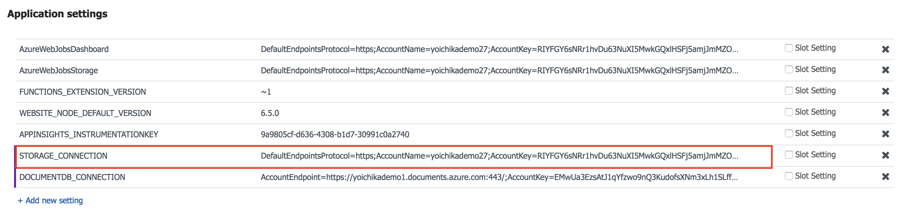
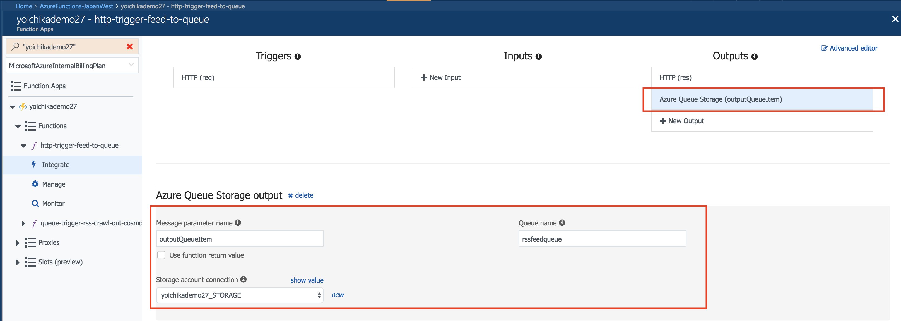

# モジュール1 - HTTPトリガーからのフィード情報のキュー書き込み

HTTPトリガーでPOSTリクエストから受け取ったRSSフィードURL をキューメッセージとして書き込みます

モジュール１とモジュール２はセットになります。

## 1. Function Appの作成 (まだ作成していない場合のみ)

* [Create a first Python Function in the Azure portal](https://github.com/yokawasa/azure-functions-python-samples/blob/master/docs/create-function-app-in-azure-portal.md)をベースにAzureポータルで作成

## 2. ソースコードをGithubよりダウンロード(まだの場合のみ)
レポジトリ: https://github.com/yokawasa/azure-functions-python-samples

```
git clone https://github.com/yokawasa/azure-functions-python-samples.git
```
もしくはレポジトリからZIPで[ダウンロード](https://github.com/yokawasa/azure-functions-python-samples/archive/master.zip)

モジュール1のマテリアル配置場所: azure-functions-python-samples/handson/module1配下

## 3. ストレージアカウント

RSSフィードURL書き込み用にキューストレージが必要。基本的に1のFunctions App作成時に作るストテージアカウントを使用する。もしFunction App用と分けたい場合、別途作成いただいても問題ありません。ストレージの種類は汎用ストレージを選択ください。

* [ストレージアカウントの作成方法](https://docs.microsoft.com/ja-jp/azure/storage/common/storage-create-storage-account#create-a-storage-account)

## 4. Functionのデプロイ

Azureポータルまたはコマンドでデプロイ

* Azureポータルの場合
手順については[こちら](../../docs/create-function-app-in-azure-portal.md)を参照ください

* コマンドの場合 (ここではgit)
手順については[こちら](../../docs/local-git-deployment_ja.md)を参照ください

## 5. Outバインディングのストレージ文字列の設定

下記function.jsonのOutバインディングのストレージ文字列("STORAGE_CONNECTION"にあたる）の設定を行う。 

```
{
  "bindings": [
    {
      "authLevel": "function",
      "type": "httpTrigger",
      "direction": "in",
      "name": "req",
      "methods": [
        "post"
      ]
    },
    {
      "type": "http",
      "direction": "out",
      "name": "res"
    },
    {
      "type": "queue",
      "name": "outputQueueItem",
      "queueName": "rssfeedqueue",
      "connection": "STORAGE_CONNECTION",
      "direction": "out"
    }
  ],
  "disabled": false
}
```

設定は２とおり

1. App SettingsにSTORAGE_CONNECTIONの変数とその値を追加


2. ポータルのFunction UIのIntegrationページでストレージ文字列の設定をする


## 6. Functionのテスト

HTTP POSTリクエストを送信してRSSフィードURLが最終的に指定のキューに入ることを確認する. RSSフィード送信用パラメータfeedurlにRSSフィードURLを指定する

POSTリクエスト送信例:
```
curl -s -H "Content-Type: application/json; charset=UTF-8" -XPOST "https://yoichikademo27.azurewebsites.net/api/http-trigger-feed-to-queue?code=dTtNrLDYaaOrF3Gl6lkZfPRMB7Z9I47wYyJhCUWbvnHrzgOUJTp2dw==" -d'{ "feedurl": "https://azure.microsoft.com/en-us/blog/feed/" }'
```

キューの確認方法 (キュー名:rssfeedqueue )
Azureポータルもしくは[ストレージエクスプローラー](https://azure.microsoft.com/ja-jp/features/storage-explorer/)でキュー名rssfeedqueueの中を確認ください
