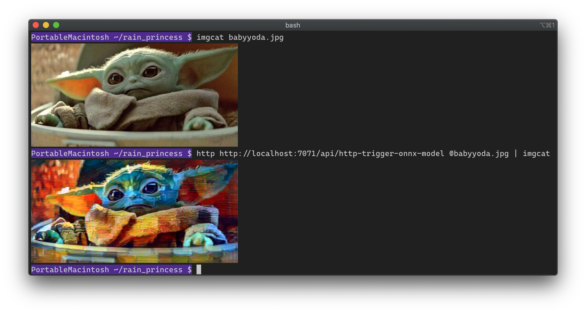

# http-trigger-onnx-model (Python)

| Sample | Description | Trigger | In Bindings | Out Bindings
| ------------- | ------------- | ------------- | ----------- | ----------- |
| `http-trigger-onnx-model` | This function demonstrates running an inference using an ONNX model. It is triggered by an HTTP request. See _[Try it out](#try-it-out)_ for usage. | HTTP | NONE | HTTP |

The style transfer model used in this function is called _Rain Princess_. It is downloaded from the [ONNX Model Zoo][3]. 

Artistic style transfer models mix the content of an image with the style of another image. Examples of the styles can be seen [here][4].

Open Neural Network Exchange (ONNX) is an open standard format for representing machine learning models. ONNX is supported by a community of partners who have implemented it in many frameworks and tools.

The ONNX Model Zoo is a collection of pre-trained, state-of-the-art models in the ONNX format contributed by community members like you. See https://github.com/onnx/models for more.

You should be able to use other ONNX models in your function by rewriting the preprocess/postprocess code and wiring the expected inputs and outputs.

## Sample run

This example is probably not going to age well. However the pun stands on its own. Shown here: [httpie][1], [imgcat][2].

## Dependencies
```
Pillow==7.0.0
onnxruntime==1.1.0
numpy==1.18.1
```

Make sure you have these in your `requirements.txt` at the root of your function app.

## Configuration
As specified in `functions.json`, this function is triggered by an HTTP request. It expects a POST request with raw image bytes (JPEG/PNG/whatever the Pillow library can open). Output is an HTTP response with the resulting style transferred image (JPEG encoded).

```json
{
  "scriptFile": "__init__.py",
  "bindings": [
    {
      "authLevel": "function",
      "type": "httpTrigger",
      "direction": "in",
      "name": "req",
      "methods": [
        "post"
      ]
    },
    {
      "type": "http",
      "direction": "out",
      "name": "$return"
    }
  ]
}
```

## How to develop and publish the functions

### Local development

```sh
func host start
```

### Try it out
```bash
# Make a POST request
$ curl -s --data-binary @babyyoda.jpg http://localhost:7071/api/http-trigger-onnx-model -o out.jpg

# Open the resulting image (on a Mac)
# Use feh or xdg-open on Linux
$ open out.jpg
```

### Publish the function to the cloud

Publish the function to the cloud
```sh
FUNCTION_APP_NAME="MyFunctionApp"
func azure functionapp publish $FUNCTION_APP_NAME --build-native-deps --no-bundler
```

Add Functions App Settings
```sh
FUNCTION_STORAGE_CONNECTION="*************"
az webapp config appsettings set \
  -n $FUNCTION_APP_NAME \
  -g $RESOURCE_GROUP \
  --settings \
    MyStorageConnectionString=$FUNCTION_STORAGE_CONNECTION
```


[1]: https://httpie.org/
[2]: https://iterm2.com/documentation-images.html
[3]: https://github.com/onnx/models/tree/master/vision/style_transfer/fast_neural_style
[4]: https://github.com/pytorch/examples/tree/master/fast_neural_style#models
